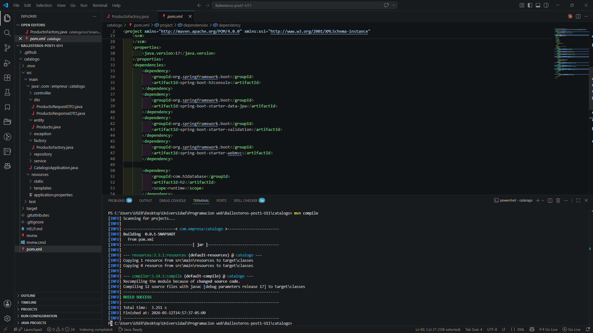

# Ballesteros-post1-U11 — Refactorización con SOLID, DAO/DTO y @ControllerAdvice

Proyecto Spring Boot desarrollado para la Unidad 11 de Programación Web (UDES 2026).  
Aplica principios SOLID (SRP y DIP), patrones DAO y DTO, Factory para conversión de objetos  
y manejo centralizado de excepciones con `@RestControllerAdvice`.

---

## Arquitectura en capas

```
controller/        ← Recibe peticiones HTTP, delega en el Service
service/           ← Lógica de negocio (interfaz + implementación)
repository/        ← Acceso a datos, extiende JpaRepository (patrón DAO)
dto/               ← Objetos de transferencia (RequestDTO y ResponseDTO)
entity/            ← Entidad JPA mapeada a la base de datos
factory/           ← Conversión entre entidad y DTOs (patrón Factory)
exception/         ← Manejo centralizado de errores con @RestControllerAdvice
```

### Relación entre componentes

```
ProductoController
    └── ProductoService (interfaz — DIP)
            └── ProductoServiceImpl
                    ├── ProductoRepository  (DAO — extiende JpaRepository)
                    └── ProductoFactory
                            ├── toEntity(ProductoRequestDTO)  → Producto
                            └── toResponseDTO(Producto)       → ProductoResponseDTO

GlobalExceptionHandler (@RestControllerAdvice)
    ├── RecursoNoEncontradoException  → 404
    ├── MethodArgumentNotValidException → 400
    └── Exception genérica             → 500
```

---

## Requisitos

- Java 17+
- Maven 3.9.x
- Spring Boot 3.2.x (o superior)

---

## Ejecución

```bash
# Clonar el repositorio
git clone https://github.com/tu-usuario/Ballesteros-post1-U11.git
cd Ballesteros-post1-U11/catalogo

# Iniciar la aplicación
mvn spring-boot:run
```

La app queda disponible en `http://localhost:8080`.  
La base de datos H2 en memoria se crea automáticamente al iniciar.

---

## Endpoints disponibles

| Método | URL                     | Descripción                        | Status |
|--------|-------------------------|------------------------------------|--------|
| GET    | /api/productos          | Lista todos los productos activos  | 200    |
| GET    | /api/productos/{id}     | Busca un producto por id           | 200    |
| POST   | /api/productos          | Crea un nuevo producto             | 201    |
| DELETE | /api/productos/{id}     | Elimina un producto por id         | 204    |

### Ejemplo POST

**Request:**
```json
{
  "nombre": "Laptop",
  "precio": 3500000,
  "categoria": "ELECTRONICA"
}
```

**Response 201:**
```json
{
  "id": 1,
  "nombre": "Laptop",
  "precio": 3500000.0,
  "categoria": "ELECTRONICA"
}
```

### Manejo de errores

**404 — Producto no encontrado:**
```json
{
  "status": 404,
  "error": "Not Found",
  "mensaje": "Producto con id 999 no encontrado.",
  "timestamp": "2026-05-12T16:00:00",
  "path": "/api/productos/999"
}
```

**400 — Validación fallida (body vacío):**
```json
{
  "status": 400,
  "error": "Bad Request",
  "mensaje": "nombre: El nombre es obligatorio; precio: El precio debe ser mayor a cero",
  "timestamp": "2026-05-12T16:00:00",
  "path": "/api/productos"
}
```

---

## Checkpoints verificados

---

### Checkpoint 1 — Entidad, DTOs y Factory



---

### Checkpoint 2 — Service, Repository y endpoints


---

### Checkpoint 3 — GlobalExceptionHandler


